# Serviqo: Registration & Authentication Diagrams

This document contains high-resolution UML diagrams for the Serviqo platform's registration and authentication workflows, following strict professional engineering standards.

## 1. Activity Diagram: User Registration & OTP Verification
This diagram illustrates the control flow from account creation to role-based redirection, ensuring clear separation of responsibilities between the User, Frontend, and Backend systems.

```mermaid
---
title: Serviqo - Registration & OTP Verification Activity Flow
---
flowchart TD
    %% --- Node Definitions ---
    Start(( ))
    EndCustomer((( )))
    EndWorkerOnboarding((( )))

    %% --- Swimlanes (Logical Grouping) ---
    subgraph User_Actor [User]
        direction TB
        U_OpenSignup[Navigate to Signup]
        U_SelectRole[Select User Role]
        U_SubmitForm[Submit Registration Form]
        U_ReceiveOTP[Receive OTP Code]
        U_EnterOTP[Input Verification OTP]
        U_ResendOTP[Request New OTP]
    end

    subgraph Frontend_System [Frontend App]
        direction TB
        F_Validate[Validate Input Format]
        F_CheckAvail[Request Availability Check]
        F_VerifyAvail{Is Phone/Email Unique?}
        F_ShowError[Display Error Message]
        F_RedirectVerify[Redirect to Verification]
        F_SubmitOTP[Forward OTP for Verification]
        F_VerifyStatus{Verification Result?}
        F_RoleCheck{Identify User Role}
        F_RouteCustomer[Route to Customer Dashboard]
        F_RouteWorker[Route to Worker Onboarding]
    end

    subgraph Backend_System [Backend Service]
        direction TB
        B_Signup[Process Signup Request]
        B_Security[Hash Password & Generate OTP]
        B_Persist[Create Unverified User Record]
        B_Resend[Regenerate OTP & Update DB]
        B_Verify[Validate OTP and Expiry]
        B_Auth[Update Status & Issue Session]
    end

    %% --- Flow Logic ---
    Start --> U_OpenSignup
    U_OpenSignup --> U_SelectRole
    U_SelectRole --> U_SubmitForm
    U_SubmitForm --> F_Validate
    F_Validate --> F_CheckAvail
    F_CheckAvail --> F_VerifyAvail
    
    F_VerifyAvail -- "[Already Registered]" --> F_ShowError
    F_ShowError --> U_SubmitForm
    
    F_VerifyAvail -- "[Available]" --> B_Signup
    B_Signup --> B_Security
    B_Security --> B_Persist
    B_Persist --> F_RedirectVerify
    
    F_RedirectVerify --> U_ReceiveOTP
    U_ReceiveOTP --> U_EnterOTP
    U_EnterOTP --> F_SubmitOTP
    F_SubmitOTP --> B_Verify
    B_Verify --> F_VerifyStatus
    
    F_VerifyStatus -- "[Invalid OTP]" --> U_EnterOTP
    F_VerifyStatus -- "[OTP Expired]" --> U_ResendOTP
    
    U_ResendOTP --> B_Resend
    B_Resend --> U_ReceiveOTP
    
    F_VerifyStatus -- "[Valid]" --> B_Auth
    B_Auth --> F_RoleCheck
    
    F_RoleCheck -- "[Customer]" --> F_RouteCustomer
    F_RoleCheck -- "[Worker]" --> F_RouteWorker
    
    F_RouteCustomer --> EndCustomer
    F_RouteWorker --> EndWorkerOnboarding

    %% --- Visual Styling ---
    style Start fill:#000,stroke:#000
    style EndCustomer fill:#000,stroke:#000,stroke-width:4px
    style EndWorkerOnboarding fill:#000,stroke:#000,stroke-width:4px
    
    classDef action fill:#f9f9f9,stroke:#333,stroke-width:1px,rx:5,ry:5;
    classDef decision fill:#fff,stroke:#333,stroke-width:2px;
    
    class U_OpenSignup,U_SelectRole,U_SubmitForm,U_ReceiveOTP,U_EnterOTP,U_ResendOTP action;
    class F_Validate,F_CheckAvail,F_ShowError,F_RedirectVerify,F_SubmitOTP,F_RouteCustomer,F_RouteWorker action;
    class B_Signup,B_Security,B_Persist,B_Resend,B_Verify,B_Auth action;
    class F_VerifyAvail,F_VerifyStatus,F_RoleCheck decision;
```

---

## 2. Sequence Diagram: Authentication Micro-Flows
The following diagram outlines the chronological interactions between system participants for all authentication scenarios (Flows A-F).

```mermaid
sequenceDiagram
    autonumber
    
    actor User
    participant UI as Web/Mobile App
    participant Auth as Auth Service
    participant DB as Database
    participant Worker as Worker Service
    participant OAuth as Google Auth
    
    %% --- Flow A: Signup & OTP ---
    rect rgb(240, 248, 255)
        Note over User, DB: Flow A: Signup & OTP Verification
        User->>UI: Submit Signup (name, role, credentials)
        activate UI
        UI->>Auth: POST /auth/signup
        activate Auth
        Auth->>DB: Check Phone Availability
        DB-->>Auth: Available
        Auth->>Auth: Hash Password & Generate OTP
        Auth->>DB: Create User (isVerified: false)
        Auth-->>UI: 201 Created (userId)
        deactivate Auth
        UI-->>User: Show OTP Screen
        deactivate UI
        
        Note right of Auth: OTP logged in dev / sent via SMS
        
        User->>UI: Enter OTP
        activate UI
        UI->>Auth: POST /auth/verify-otp
        activate Auth
        Auth->>DB: Fetch User & Check OTP/Expiry
        
        alt OTP Valid
            Auth->>DB: Update isVerified: true
            Auth->>Auth: Generate JWT
            Auth-->>UI: Success + Session Cookies
            UI-->>User: Redirect to Onboarding/Dashboard
        else OTP Invalid/Expired
            Auth-->>UI: Error (400)
            UI-->>User: Show Error (Retry/Resend)
        end
        deactivate Auth
        deactivate UI
    end

    %% --- Flow B: Worker Onboarding ---
    rect rgb(245, 245, 240)
        Note over User, Worker: Flow B: Worker Onboarding (5 Steps)
        
        loop For Each Step (1-5)
            User->>UI: Submit Step Data (Profile, Skills, Availability, Portfolio, CNIC)
            activate UI
            UI->>Worker: PATCH /worker/update-...
            activate Worker
            Worker->>DB: Update Worker Record
            Worker-->>UI: 200 OK
            deactivate Worker
            UI-->>User: Navigate to Next Step
            deactivate UI
        end
    end

    %% --- Flow C: Standard Login ---
    rect rgb(250, 250, 250)
        Note over User, Auth: Flow C: Standard Login
        User->>UI: Submit Login (Identifier, Password)
        activate UI
        UI->>Auth: POST /auth/login
        activate Auth
        Auth->>DB: Find User & Verify Password
        
        alt Success
            Auth->>Auth: Generate JWT
            Auth-->>UI: Success + Session Cookies
            UI-->>User: Redirect to Dashboard
        else Failed
            Auth-->>UI: 401 Unauthorized
            UI-->>User: Show Login Error
        end
        deactivate Auth
        deactivate UI
    end

    %% --- Flow D: Admin Login with TOTP ---
    rect rgb(255, 245, 245)
        Note over User, DB: Flow D: Admin Login with TOTP MFA
        User->>UI: Submit Admin Credentials
        activate UI
        UI->>Auth: POST /auth/admin-login/verify-credentials
        activate Auth
        Auth->>DB: Validate Admin Credentials
        Auth-->>UI: 200 OK (Proceed to MFA)
        deactivate Auth
        UI-->>User: Prompt for TOTP
        
        User->>UI: Enter 6-digit TOTP
        UI->>Auth: POST /auth/admin-login (Credentials + TOTP)
        activate Auth
        Auth->>Auth: Verify TOTP Code
        Auth->>Auth: Generate JWT
        Auth-->>UI: Success + Admin Session
        deactivate Auth
        UI-->>User: Redirect to Admin Dashboard
        deactivate UI
    end

    %% --- Flow E: OTP-Based Login ---
    rect rgb(245, 255, 245)
        Note over User, DB: Flow E: OTP-Based Login (Alternative)
        User->>UI: Request OTP Login (Phone)
        activate UI
        UI->>Auth: POST /auth/request-login-otp
        activate Auth
        Auth->>DB: Find User & Generate OTP
        Auth-->>UI: 200 OK (OTP Sent)
        deactivate Auth
        UI-->>User: Show OTP Input Screen
        
        User->>UI: Enter Login OTP
        UI->>Auth: POST /auth/verify-login-otp
        activate Auth
        Auth->>DB: Validate OTP
        Auth->>Auth: Generate JWT
        Auth-->>UI: Success + Session
        deactivate Auth
        UI-->>User: Redirect to Dashboard
        deactivate UI
    end

    %% --- Flow F: Google Login ---
    rect rgb(255, 255, 240)
        Note over User, OAuth: Flow F: Login via Google (Returning Users)
        User->>UI: Click "Continue with Google"
        activate UI
        UI->>OAuth: Redirect to Google OAuth Provider
        activate OAuth
        OAuth-->>UI: Redirect with Authorization Code
        deactivate OAuth
        UI->>Auth: POST /auth/google (Auth Code)
        activate Auth
        Auth->>OAuth: Exchange Code for Profile Token
        OAuth-->>Auth: User Profile (Email)
        Auth->>DB: Find User by Email
        Auth->>Auth: Generate JWT
        Auth-->>UI: Success + Session
        deactivate Auth
        UI-->>User: Redirect to Dashboard
        deactivate UI
    end
```

