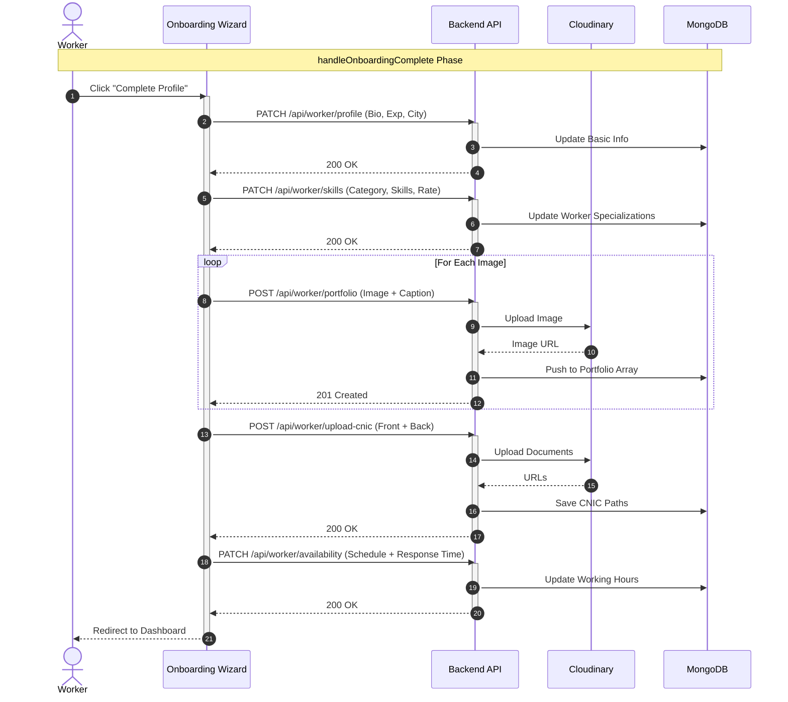

# Serviqo: Worker Onboarding Diagrams

This document contains professional UML diagrams for the Worker Onboarding process in Serviqo, based on the `Activity_2.png` specification and system implementation.

## 1. Activity Diagram: 5-Step Worker Onboarding
This diagram represents the user-centric workflow for onboarding a new service provider, including field validation loops and multi-stage data persistence.

```mermaid
---
title: Serviqo - Worker Onboarding Activity Flow
---
flowchart TD
    %% --- Node Definitions ---
    Start(( ))
    End((( )))

    %% --- Swimlanes ---
    subgraph Worker_Actor ["Worker (User)"]
        direction TB
        U_Arrive[Arrive at /onboarding]
        
        %% Step 1
        U_Step1[Fill Profile: Bio, Experience, Location]
        
        %% Step 2
        U_Step2[Select Skills, Category & Hourly Rate]
        
        %% Step 3
        U_Step3[Upload Portfolio Photos & Captions]
        U_Skip3[Optional: Skip Portfolio]
        
        %% Step 4
        U_Step4[Upload CNIC Front & Back]
        
        %% Step 5
        U_Step5[Set Working Days & Response Time]
        U_Complete[Click: Complete Profile]
    end

    subgraph Frontend_System ["Frontend (Client-Side)"]
        direction TB
        F_Step1Val{Profile Valid?}
        F_Step2Val{Skills Valid?}
        F_Step3Proc[Process Photo Reordering]
        F_Step4Val{Identity Uploaded?}
        F_Step5Val{All Required Filled?}
        
        F_Adv2[Advance to Step 2]
        F_Adv3[Advance to Step 3]
        F_Adv4[Advance to Step 4]
        F_Adv5[Advance to Step 5]
        
        F_API_Seq[Execute Sequential API Persistence]
        F_Redirect[Redirect to /worker/dashboard]
    end

    subgraph Backend_System ["Backend / Database"]
        direction TB
        B_UpdateProfile[Update Worker Profile]
        B_UpdateSkills[Update Skills & Category]
        B_AddPortfolio[Add Portfolio Items]
        B_UploadCNIC[Persist Identity Documents]
        B_UpdateAvail[Set Availability Schedule]
    end

    %% --- Flow Logic ---
    Start --> U_Arrive
    U_Arrive --> U_Step1
    
    U_Step1 --> F_Step1Val
    F_Step1Val -- "[Errors]" --> U_Step1
    F_Step1Val -- "[Valid]" --> F_Adv2
    
    F_Adv2 --> U_Step2
    U_Step2 --> F_Step2Val
    F_Step2Val -- "[Errors]" --> U_Step2
    F_Step2Val -- "[Valid]" --> F_Adv3
    
    F_Adv3 --> U_Step3
    U_Step3 --> F_Step3Proc
    U_Skip3 --> F_Adv4
    F_Step3Proc --> F_Adv4
    
    F_Adv4 --> U_Step4
    U_Step4 --> F_Step4Val
    F_Step4Val -- "[No]" --> U_Step4
    F_Step4Val -- "[Yes]" --> F_Adv5
    
    F_Adv5 --> U_Step5
    U_Step5 --> F_Step5Val
    F_Step5Val -- "[No]" --> U_Step5
    F_Step5Val -- "[Yes]" --> U_Complete
    
    U_Complete --> F_API_Seq
    
    %% Sequential API Calls
    F_API_Seq --> B_UpdateProfile
    B_UpdateProfile --> B_UpdateSkills
    B_UpdateSkills --> B_AddPortfolio
    B_AddPortfolio --> B_UploadCNIC
    B_UploadCNIC --> B_UpdateAvail
    B_UpdateAvail --> F_Redirect
    
    F_Redirect --> End

    %% --- Visual Styling ---
    style Start fill:#000,stroke:#000
    style End fill:#000,stroke:#000,stroke-width:4px
    
    classDef action fill:#f9f9f9,stroke:#333,stroke-width:1px,rx:5,ry:5;
    classDef decision fill:#fff,stroke:#333,stroke-width:2px;
    
    class U_Arrive,U_Step1,U_Step2,U_Step3,U_Skip3,U_Step4,U_Step5,U_Complete action;
    class F_Adv2,F_Adv3,F_Adv4,F_Adv5,F_Step3Proc,F_API_Seq,F_Redirect action;
    class B_UpdateProfile,B_UpdateSkills,B_AddPortfolio,B_UploadCNIC,B_UpdateAvail action;
    class F_Step1Val,F_Step2Val,F_Step4Val,F_Step5Val decision;
```

---

## 2. Sequence Diagram: Onboarding Persistence Flow
This diagram details the sequential nature of the API calls triggered upon completion of the onboarding wizard.

