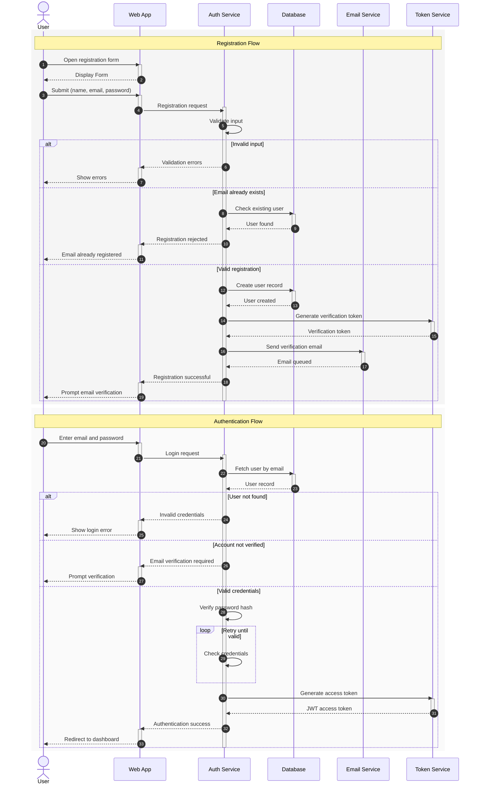

# System Architecture: Registration & Authentication

The following sequence diagram outlines the interaction between the user, the web application, and the backend microservices.

```mermaid
sequenceDiagram
    autonumber
    
    actor User
    participant UI as Web App
    participant Auth as Auth Service
    participant DB as Database
    participant Mail as Email Service
    participant Token as Token Service

    %% --- Registration Flow ---
    rect rgb(245,245,245)
        Note over User, Token: Registration Flow
        
        User->>UI: Open registration form
        activate UI
        UI-->>User: Display Form
        deactivate UI

        User->>UI: Submit (name, email, password)
        activate UI
        UI->>Auth: Registration request
        activate Auth
        deactivate UI

        Auth->>Auth: Validate input

        alt Invalid input
            Auth-->>UI: Validation errors
            activate UI
            UI-->>User: Show errors
            deactivate UI
            
        else Email already exists
            Auth->>DB: Check existing user
            activate DB
            DB-->>Auth: User found
            deactivate DB
            Auth-->>UI: Registration rejected
            activate UI
            UI-->>User: Email already registered
            deactivate UI

        else Valid registration
            Auth->>DB: Create user record
            activate DB
            DB-->>Auth: User created
            deactivate DB

            Auth->>Token: Generate verification token
            activate Token
            Token-->>Auth: Verification token
            deactivate Token

            Auth->>Mail: Send verification email
            activate Mail
            Mail-->>Auth: Email queued
            deactivate Mail

            Auth-->>UI: Registration successful
            activate UI
            UI-->>User: Prompt email verification
            deactivate UI
        end
        deactivate Auth
    end

    %% --- Authentication Flow ---
    rect rgb(250,250,250)
        Note over User, Token: Authentication Flow

        User->>UI: Enter email and password
        activate UI
        UI->>Auth: Login request
        activate Auth
        deactivate UI

        Auth->>DB: Fetch user by email
        activate DB
        DB-->>Auth: User record
        deactivate DB

        alt User not found
            Auth-->>UI: Invalid credentials
            activate UI
            UI-->>User: Show login error
            deactivate UI

        else Account not verified
            Auth-->>UI: Email verification required
            activate UI
            UI-->>User: Prompt verification
            deactivate UI

        else Valid credentials
            Auth->>Auth: Verify password hash
            
            loop Retry until valid
                Auth->>Auth: Check credentials
            end

            Auth->>Token: Generate access token
            activate Token
            Token-->>Auth: JWT access token
            deactivate Token

            Auth-->>UI: Authentication success
            activate UI
            UI-->>User: Redirect to dashboard
            deactivate UI
        end
        deactivate Auth
    end
```
