# Serviqo System Design: Sequence Diagram - Registration & Authentication

This document outlines the interaction flows for user identity management within the Serviqo platform. It covers registration, worker onboarding, and various authentication methods including MFA and Social Login.

```mermaid
sequenceDiagram
    autonumber
    
    actor User as User / Admin
    participant UI as Frontend (Web/Mobile)
    participant Auth as Auth Controller
    participant Svc as Backend Service
    participant DB as MongoDB
    participant Msg as Messaging Service (OTP/Email)
    participant Google as Google OAuth 2.0
    participant MFA as MFA Provider (TOTP)

    %% --- Flow A: Customer & Worker Signup + OTP Verification ---
    rect rgb(240, 248, 255)
        Note over User, Msg: Flow A: Signup & OTP Verification
        
        User->>UI: Enter Signup Details (Role: Customer/Worker)
        activate UI
        UI->>Auth: POST /api/auth/signup
        activate Auth
        
        Auth->>Svc: Validate Input & Check Existence
        activate Svc
        Svc->>DB: findOne({ email })
        activate DB
        DB-->>Svc: null (New User)
        deactivate DB
        
        Svc->>DB: create({ user, status: 'pending' })
        activate DB
        DB-->>Svc: User Object
        deactivate DB
        
        Svc->>Msg: Generate & Send OTP
        activate Msg
        Msg-->>Svc: Success
        deactivate Msg
        
        Svc-->>Auth: User Created (Pending Verification)
        deactivate Svc
        
        Auth-->>UI: 201 Created (Redirect to /verify)
        deactivate Auth
        UI-->>User: Prompt for OTP
        deactivate UI

        User->>UI: Submit OTP
        activate UI
        UI->>Auth: POST /api/auth/verify-otp
        activate Auth
        Auth->>Svc: Verify OTP
        activate Svc
        Svc->>DB: updateOne({ status: 'verified' })
        activate DB
        DB-->>Svc: Success
        deactivate DB
        Svc-->>Auth: Verified
        deactivate Svc
        Auth-->>UI: 200 OK (JWT Issued)
        deactivate Auth
        UI-->>User: Verification Success
        deactivate UI
    end

    %% --- Flow B: Worker Onboarding (/onboarding) ---
    rect rgb(245, 245, 245)
        Note over User, DB: Flow B: Worker Onboarding (5 Steps)
        
        loop Steps 1 to 5 (Profile, Skills, Portfolio, CNIC, Availability)
            User->>UI: Provide Step Data
            activate UI
            UI->>Auth: PATCH /api/worker/onboarding
            activate Auth
            Auth->>Svc: Process Step Data
            activate Svc
            Svc->>DB: updateOne({ workerProfile })
            activate DB
            DB-->>Svc: Success
            deactivate DB
            Svc-->>Auth: Step X Complete
            deactivate Svc
            Auth-->>UI: 200 OK
            deactivate Auth
            UI-->>User: Load Next Step
            deactivate UI
        end
        UI-->>User: Onboarding Complete -> Dashboard
    end

    %% --- Flow C: Standard Login (Returning Users) ---
    rect rgb(255, 250, 240)
        Note over User, DB: Flow C: Standard Login
        
        User->>UI: Enter Email & Password
        activate UI
        UI->>Auth: POST /api/auth/login
        activate Auth
        Auth->>Svc: Authenticate User
        activate Svc
        Svc->>DB: findOne({ email })
        activate DB
        DB-->>Svc: User Record + Hash
        deactivate DB
        
        alt Valid Credentials
            Svc-->>Auth: Success (User Data)
            Auth-->>UI: 200 OK (JWT + Role)
            UI-->>User: Redirect to Dashboard
        else Invalid Credentials
            Svc-->>Auth: Failure
            Auth-->>UI: 401 Unauthorized
            UI-->>User: Show Error Message
        end
        deactivate Svc
        deactivate Auth
        deactivate UI
    end

    %% --- Flow D: Admin Login with TOTP MFA ---
    rect rgb(240, 255, 240)
        Note over User, MFA: Flow D: Admin Login with TOTP MFA
        
        User->>UI: Admin Login Request
        activate UI
        UI->>Auth: POST /api/admin/login
        activate Auth
        Auth->>Svc: Verify Admin Password
        activate Svc
        Svc-->>Auth: Valid (MFA Required)
        deactivate Svc
        Auth-->>UI: 202 Accepted (MFA Challenge)
        deactivate Auth
        UI-->>User: Prompt for TOTP Code
        
        User->>UI: Submit TOTP Code
        activate UI
        UI->>Auth: POST /api/admin/verify-mfa
        activate Auth
        Auth->>MFA: Validate Code against Secret
        activate MFA
        MFA-->>Auth: Valid
        deactivate MFA
        Auth-->>UI: 200 OK (Admin JWT)
        deactivate Auth
        UI-->>User: Access Admin Dashboard
        deactivate UI
    end

    %% --- Flow E: OTP-Based Login (Alternative) ---
    rect rgb(255, 240, 245)
        Note over User, Msg: Flow E: OTP-Based Login
        
        User->>UI: Request OTP Login
        activate UI
        UI->>Auth: POST /api/auth/request-login-otp
        activate Auth
        Auth->>Msg: Send Login OTP
        activate Msg
        Msg-->>Auth: Sent
        deactivate Msg
        Auth-->>UI: 200 OK
        deactivate Auth
        UI-->>User: Prompt for Login OTP
        
        User->>UI: Submit Login OTP
        activate UI
        UI->>Auth: POST /api/auth/login-otp
        activate Auth
        Auth->>Svc: Verify & Issue Token
        Svc-->>Auth: Success
        Auth-->>UI: 200 OK (JWT)
        deactivate Auth
        UI-->>User: Login Success
        deactivate UI
    end

    %% --- Flow F: Login via Google ---
    rect rgb(245, 245, 255)
        Note over User, Google: Flow F: Login via Google (Returning Users)
        
        User->>UI: Click "Continue with Google"
        activate UI
        UI->>Google: Redirect to Google Consent
        activate Google
        Google-->>User: Show Consent Screen
        User->>Google: Approve & Authorize
        Google-->>UI: Return Authorization Code
        deactivate Google
        
        UI->>Auth: POST /api/auth/google
        activate Auth
        Auth->>Google: Exchange Code for Profile
        activate Google
        Google-->>Auth: User Profile (Email, ID)
        deactivate Google
        
        Auth->>Svc: Find or Register User
        activate Svc
        Svc->>DB: findOrCreate({ googleId })
        activate DB
        DB-->>Svc: User Record
        deactivate DB
        Svc-->>Auth: Success
        deactivate Svc
        
        Auth-->>UI: 200 OK (JWT)
        deactivate Auth
        UI-->>User: Redirect to Dashboard
        deactivate UI
    end
```

