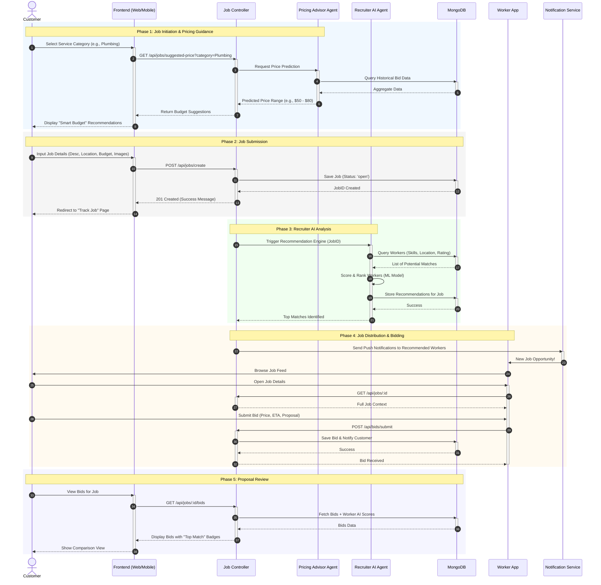

# Serviqo System Design: Sequence Diagram - Job Posting & AI Recommendation

This diagram illustrates the lifecycle of a service request, from initial creation with AI pricing guidance to automated worker recommendation and the bidding process.

