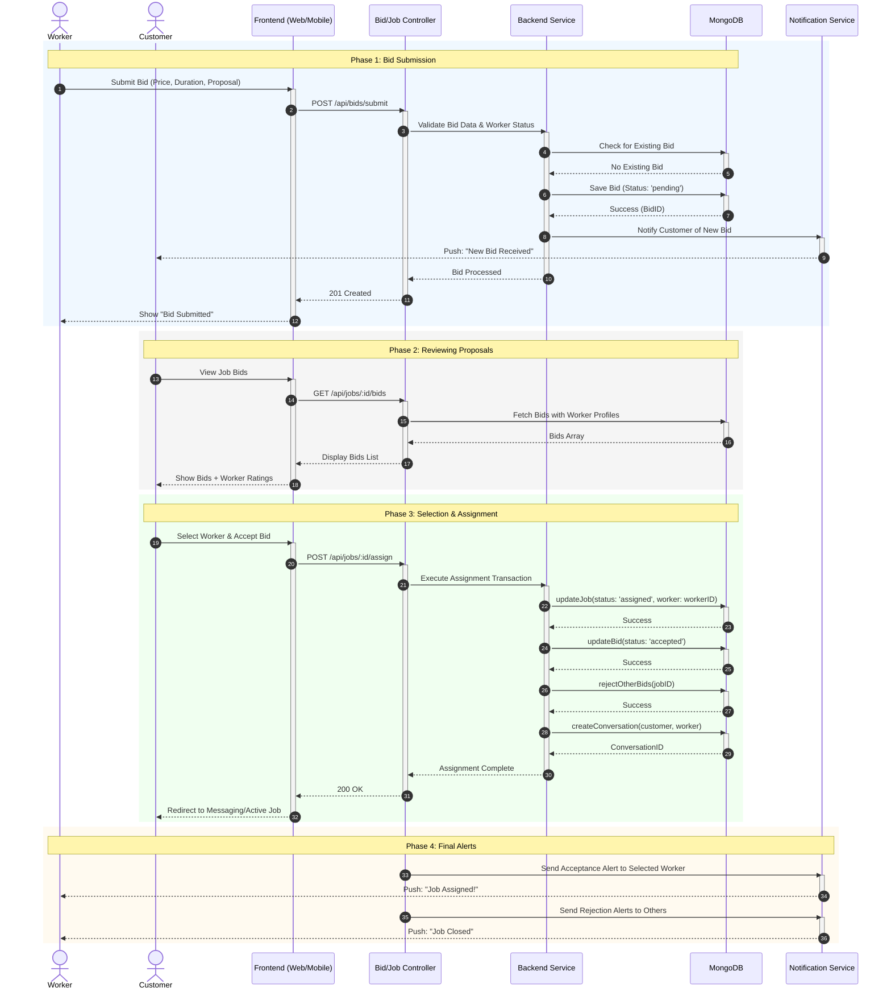

# Serviqo System Design: Sequence Diagram - Bidding & Job Assignment

This document details the process of bid submission, proposal review, and the final job assignment flow between customers and workers.

