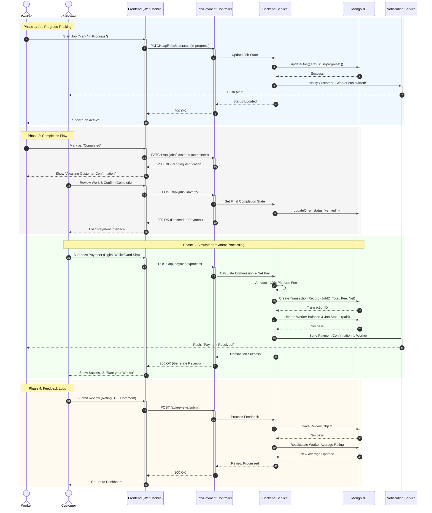

# Serviqo System Design: Sequence Diagram - Job Tracking, Review & Payment

This document outlines the final phase of the service lifecycle, including real-time status updates, simulated payment handling, and the feedback mechanism.

