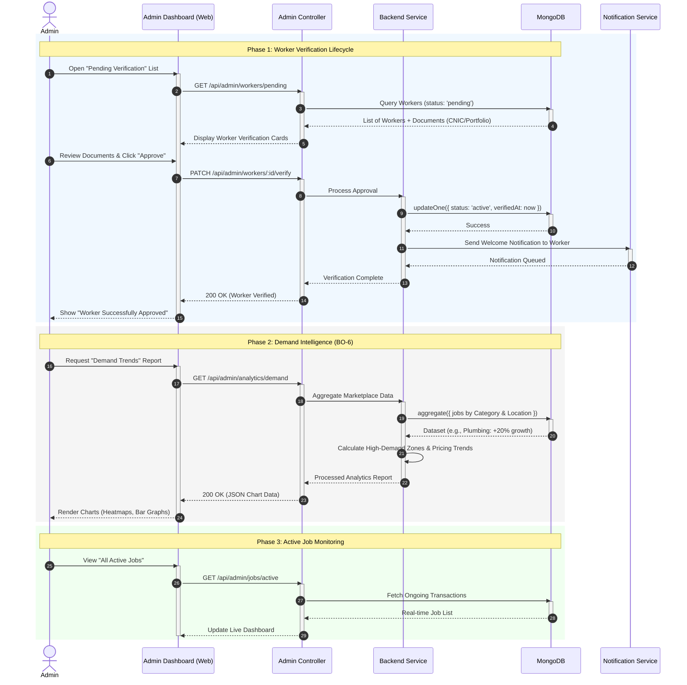

# Serviqo System Design: Sequence Diagram - Admin Operations & System Analytics

This document outlines the administrative lifecycle for worker verification and the generation of demand-based market analytics.

