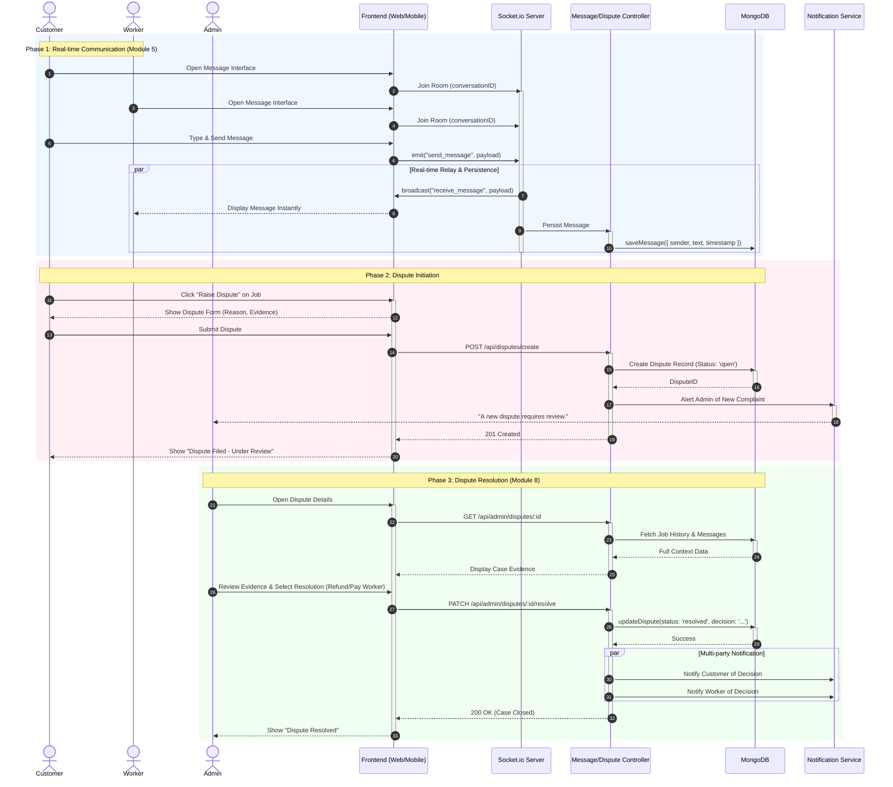

# Serviqo System Design: Sequence Diagram - Communication & Dispute Management

This document details the real-time interaction between users via messaging and the formal process for raising and resolving job disputes.

