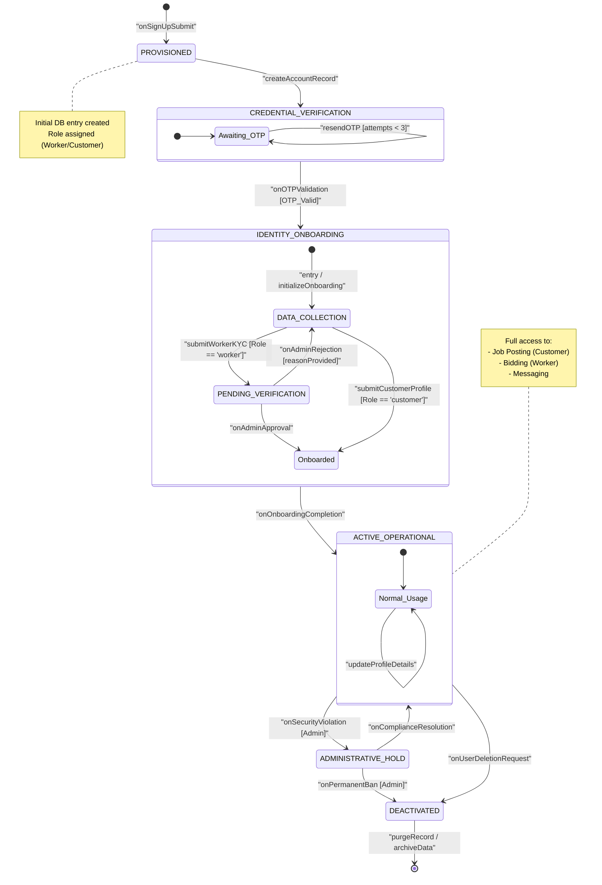

# State Diagram 1: User Account Lifecycle

This state diagram outlines the lifecycle of a user account within the Serviqo platform, from initial registration through verification, onboarding, active usage, and eventual deactivation.

### Key States Description
*   **PROVISIONED:** The account exists in the database with basic credentials but is not yet usable.
*   **CREDENTIAL_VERIFICATION:** A security phase where the user must prove ownership of their phone/email via OTP.
*   **IDENTITY_ONBOARDING:** A composite state where workers complete a 5-step setup (Portfolio, CNIC) and customers provide basic details. Workers remain in `PENDING_VERIFICATION` until manual admin approval.
*   **ACTIVE_OPERATIONAL:** The standard state for verified users with full platform features.
*   **ADMINISTRATIVE_HOLD:** A restricted state triggered by an Admin for suspicious activity.
*   **DEACTIVATED:** The final state before data archival or deletion.
