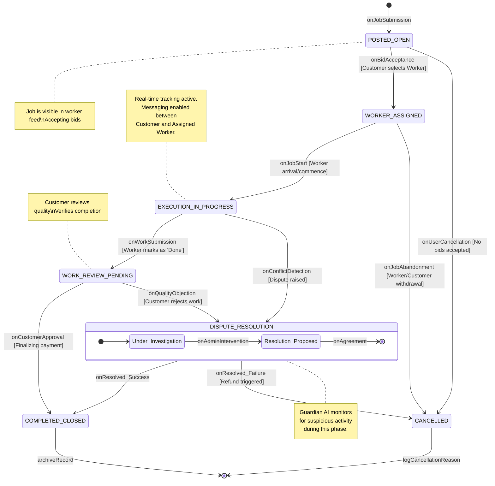

# State Diagram 2: Job Lifecycle

This state diagram illustrates the operational flow of a service request (Job) from its creation by a customer to its final resolution, including standard and exceptional termination paths.

### Key States Description
*   **POSTED_OPEN:** The initial state where the job is live and the Recruiter AI Agent begins inviting suitable workers.
*   **WORKER_ASSIGNED:** A contract is formed. The job is no longer visible to other workers.
*   **EXECUTION_IN_PROGRESS:** The worker is physically or digitally performing the service. Real-time status updates are expected.
*   **WORK_REVIEW_PENDING:** The worker has claimed completion. The system waits for the customer to verify the result before releasing funds.
*   **COMPLETED_CLOSED:** The "Happy Path" termination. Feedback/Reviews are exchanged, and payment is finalized.
*   **DISPUTE_RESOLUTION:** A non-linear state where an Administrator or system logic must mediate a conflict between the parties.
*   **CANCELLED:** The job is terminated without completion. Reasons are logged for platform analytics.
