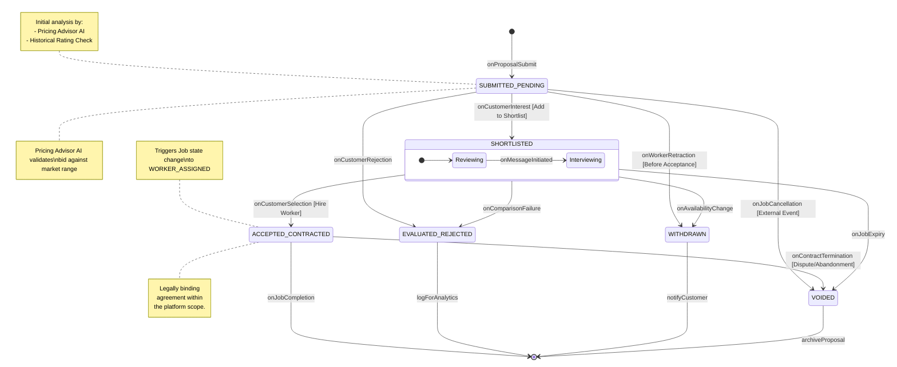

# State Diagram 3: Bid Lifecycle

This state diagram defines the lifecycle of a worker's proposal (Bid) from submission through evaluation, customer decision, and final status synchronization with the parent Job.

### Key States Description
*   **SUBMITTED_PENDING:** The initial state where the bid is visible to the customer. The Pricing Advisor AI may tag the bid as "Fair," "High," or "Competitive" during this phase.
*   **SHORTLISTED:** A composite state where the customer has shown specific interest, potentially leading to further communication (Interviewing) via the in-app messaging system.
*   **ACCEPTED_CONTRACTED:** The winning bid. This transition is synchronous with the Job moving to the `WORKER_ASSIGNED` state.
*   **EVALUATED_REJECTED:** The customer has explicitly declined the proposal.
*   **WITHDRAWN:** The worker has removed their bid before it was accepted, often due to a change in availability.
*   **VOIDED:** An "automatic" terminal state triggered when the parent Job is cancelled, expires, or is closed without this specific bid being selected.
