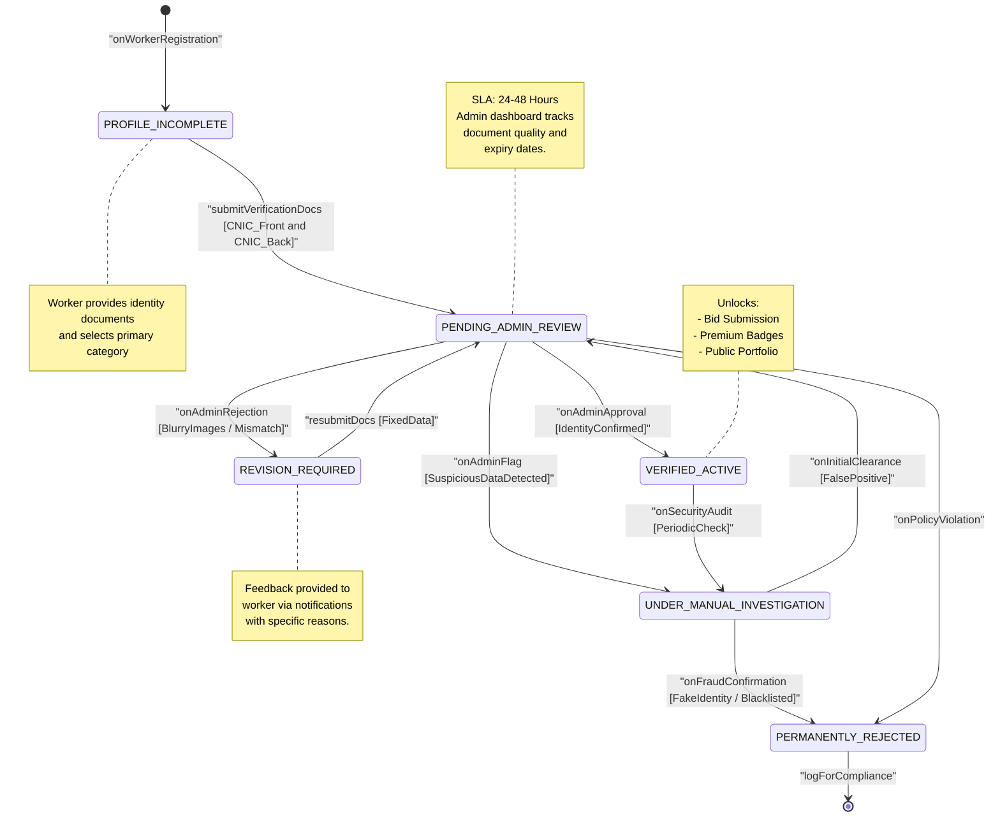

# State Diagram 4: Worker Verification Workflow

This state diagram outlines the multi-stage trust and safety process that service providers must undergo to gain "Verified" status on the Serviqo platform.

### Key States Description
*   **PROFILE_INCOMPLETE:** The worker has an account but has not yet submitted the required government-issued identity documents (CNIC).
*   **PENDING_ADMIN_REVIEW:** Documents have been uploaded. The worker appears in the Admin Dashboard verification queue.
*   **UNDER_MANUAL_INVESTIGATION:** A high-scrutiny state triggered if an administrator identifies potential risks or anomalies requiring deeper background checks or secondary verification.
*   **VERIFIED_ACTIVE:** The "Gold Standard" state. The worker is fully authorized to participate in the marketplace and use all agentic AI features.
*   **REVISION_REQUIRED:** Documents were rejected for fixable reasons (e.g., poor lighting, expired ID). The worker is prompted to update their submission.
*   **PERMANENTLY_REJECTED:** The identity was flagged as fraudulent or in violation of platform safety policies. This state is terminal to prevent platform abuse.
