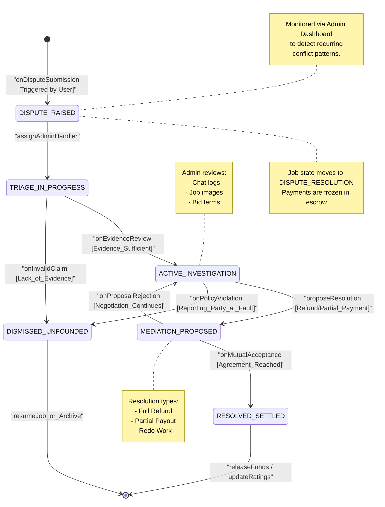

# State Diagram 5: Dispute Resolution Lifecycle

This state diagram illustrates the procedural lifecycle of a formal dispute within the Serviqo platform, detailing how conflicts between customers and workers are managed and resolved by administrators.

### Key States Description
*   **DISPUTE_RAISED:** The formal entry point. Triggered when either party indicates a failure in service delivery or contract terms.
*   **TRIAGE_IN_PROGRESS:** An initial administrative phase where the dispute is assigned to a human moderator and checked for basic validity.
*   **ACTIVE_INVESTIGATION:** The core analytical phase. The Administrator examines all platform-recorded evidence (messages, timestamps, image uploads) to determine the root cause.
*   **MEDIATION_PROPOSED:** A state where the Admin offers a compromise or a specific ruling (e.g., 50% payment) to both parties.
*   **RESOLVED_SETTLED:** The successful terminal state. Both parties have accepted the resolution, and final accounting (simulated payments) is executed.
*   **DISMISSED_UNFOUNDED:** The dispute is closed without action, typically because the claim was deemed invalid or the reporter violated platform terms.
