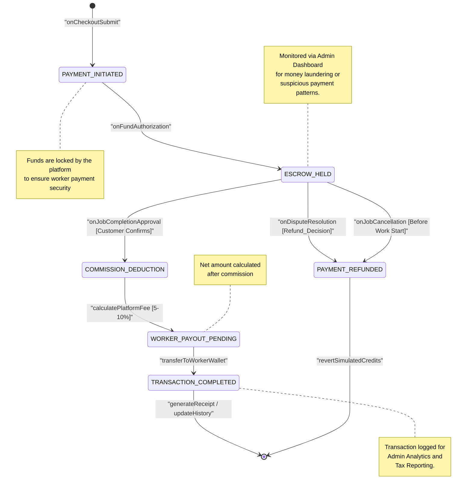

# State Diagram 6: Simulated Payment Transaction

This state diagram models the financial lifecycle of a job payment (simulated) from the moment a customer initiates payment through escrow management, platform commission deduction, and final worker payout.

### Key States Description
*   **PAYMENT_INITIATED:** The user has triggered the payment process. The system validates the balance or simulated card details.
*   **ESCROW_HELD:** A critical trust state. Funds are "parked" by the platform. The worker can see that the money is secured, but they cannot access it until the job is done.
*   **COMMISSION_DEDUCTION:** Once the job is approved, the system calculates and subtracts the platform's service fee before finalizing the worker's share.
*   **WORKER_PAYOUT_PENDING:** The net funds are staged for transfer to the worker's internal wallet or simulated account.
*   **TRANSACTION_COMPLETED:** The successful terminal state. Funds have moved, and the ledger is balanced.
*   **PAYMENT_REFUNDED:** Triggered by cancellations or disputes. Funds are returned to the customer's original simulated source.
