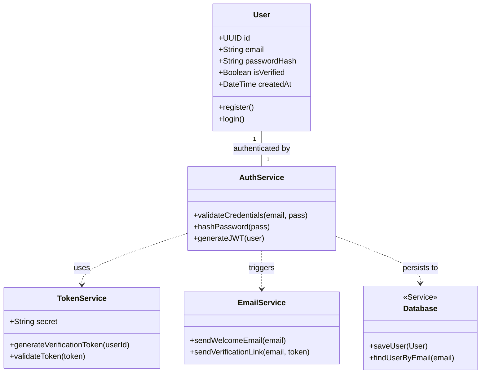

```mermaid
classDiagram
    class User {
        +UUID id
        +String email
        +String passwordHash
        +Boolean isVerified
        +DateTime createdAt
        +register()
        +login()
    }

    class AuthService {
        +validateCredentials(email, pass)
        +hashPassword(pass)
        +generateJWT(user)
    }

    class TokenService {
        +String secret
        +generateVerificationToken(userId)
        +validateToken(token)
    }

    class EmailService {
        +sendWelcomeEmail(email)
        +sendVerificationLink(email, token)
    }

    class Database {
        <<Service>>
        +saveUser(User)
        +findUserByEmail(email)
    }

    User "1" -- "1" AuthService : authenticated by
    AuthService ..> TokenService : uses
    AuthService ..> EmailService : triggers
    AuthService ..> Database : persists to
```
