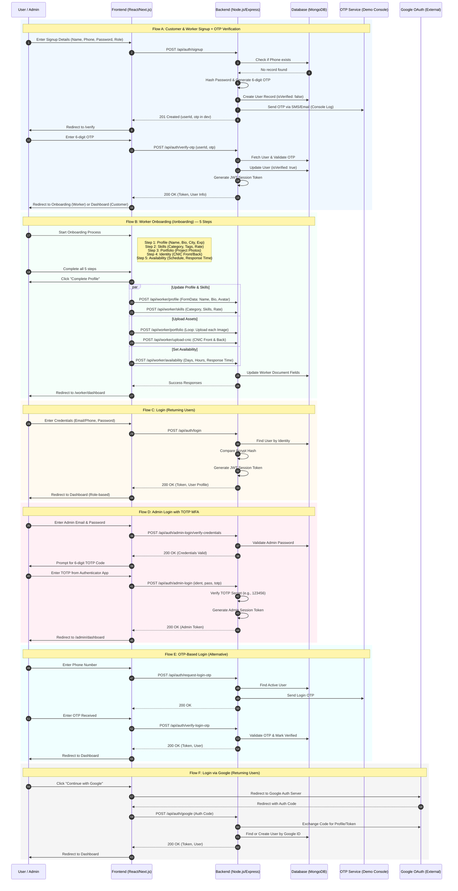

# Sequence Diagram: User Registration & Authentication

This document outlines the detailed sequence flows for the User Registration and Authentication module of the Serviqo platform. It covers customer and worker registration, the multi-step worker onboarding process, standard and administrative login procedures, and alternative authentication methods.

## 1. Sequence Diagram (Mermaid)

## 2. Flow Descriptions

### Flow A: Customer & Worker Signup + OTP Verification
This is the primary entry point for new users. The system captures basic details and ensures phone number ownership through a one-time password (OTP) before allowing access to the platform.

### Flow B: Worker Onboarding
For users registered as workers, a comprehensive 5-step onboarding process is required to build their professional profile. This includes:
1. **Profile:** Basic professional info and avatar.
2. **Skills:** Technical categorization and pricing.
3. **Portfolio:** Visual proof of work.
4. **Identity:** Mandatory CNIC verification (Front & Back).
5. **Availability:** Setting operational hours for the marketplace.

### Flow C: Login (Standard)
Standard authentication using either email or phone number with a password. The backend issues a JWT token stored in an HTTP-only cookie for secure session management.

### Flow D: Admin Login with MFA
To ensure platform security, administrators must undergo a two-step verification process. After providing valid credentials, they must enter a Time-based One-Time Password (TOTP) from an authenticator app.

### Flow E: OTP-Based Login
An alternative, passwordless login method that allows users to access their accounts using only their registered phone number and a dynamic OTP.

### Flow F: Login via Google
OAuth2 integration allowing users to sign in using their Google accounts. This flow simplifies the registration and login process for returning users.
