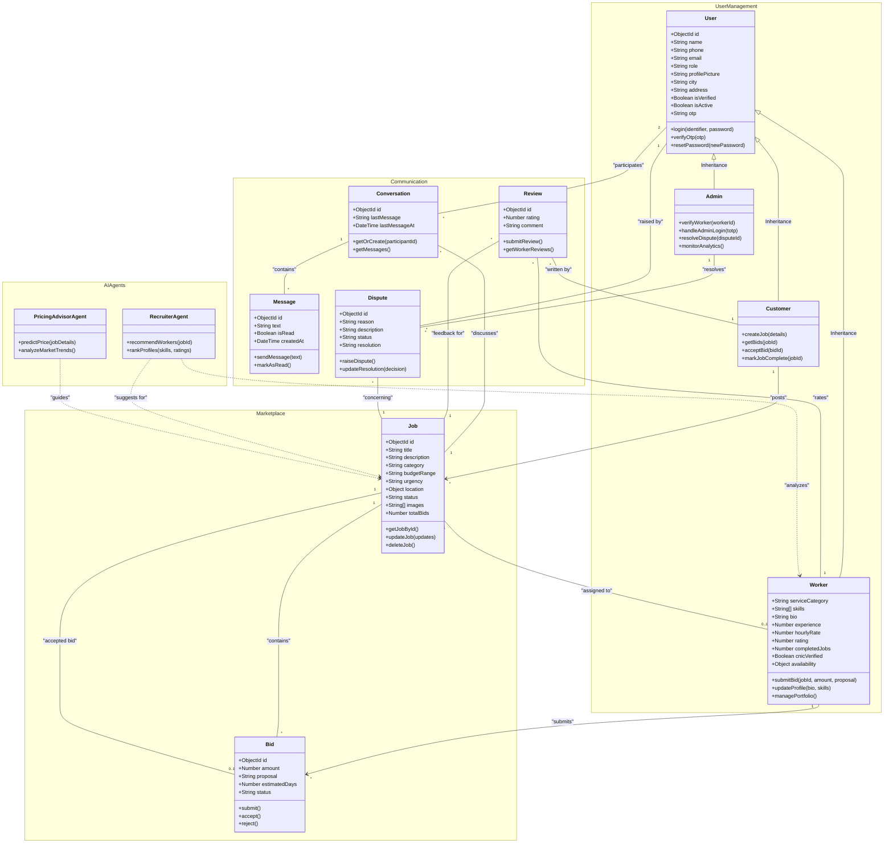

# Software Design Specification: Class Diagram

The following UML class diagram illustrates the structural architecture of the Serviqo platform, including user roles, core marketplace entities, communication modules, and AI agents.

### Diagram Description
*   **User Management**: Implements role-based access control (RBAC). The `User` class acts as the base entity for `Customer`, `Worker`, and `Admin` roles.
*   **Marketplace**: Manages the core lifecycle of a `Job` and the competitive `Bid` system. A job transitions through statuses from `open` to `completed`.
*   **Communication**: Facilitates real-time interaction via `Conversation` and `Message` entities, linked directly to specific jobs to maintain context.
*   **AI Agents**: Specialized agentic modules that provide intelligent assistance:
    *   **RecruiterAgent**: Automates worker-job matching.
    *   **PricingAdvisorAgent**: Provides data-driven budget guidance.
*   **Relationships**: 
    *   **Inheritance** is used for user roles.
    *   **Association** represents structural links (e.g., Customer posting a Job).
    *   **Dependency** (dashed arrows) indicates temporary usage or analysis by AI services.
