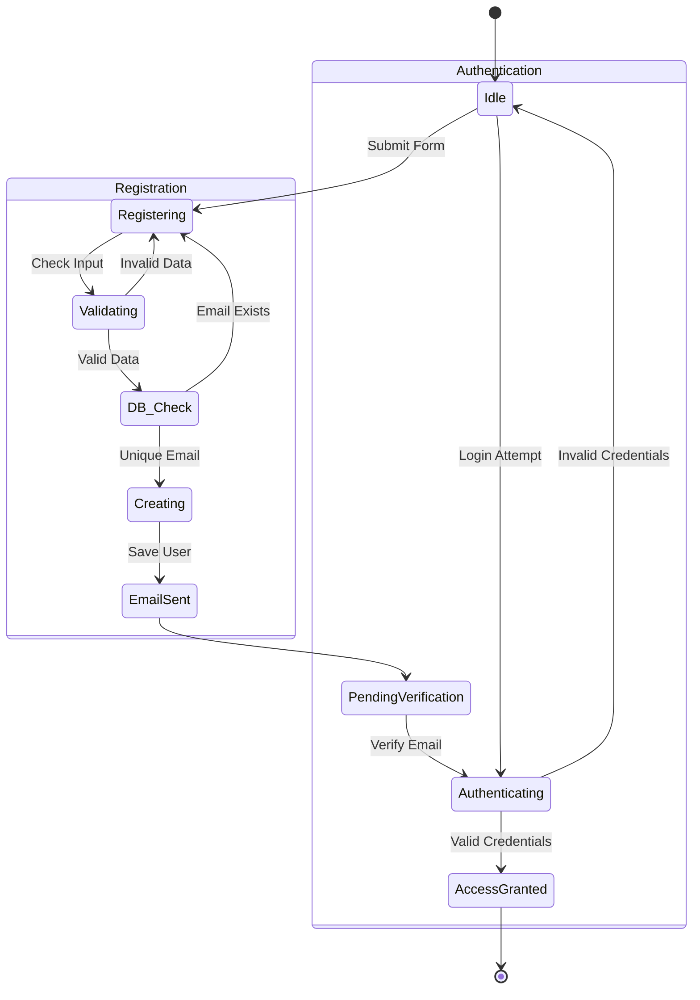

```mermaid
stateDiagram-v2
    [*] --> Idle
    
    state Registration {
        Idle --> Registering : Submit Form
        Registering --> Validating : Check Input
        Validating --> Registering : Invalid Data
        Validating --> DB_Check : Valid Data
        DB_Check --> Registering : Email Exists
        DB_Check --> Creating : Unique Email
        Creating --> EmailSent : Save User
        EmailSent --> PendingVerification
    }

    state Authentication {
        PendingVerification --> Authenticating : Verify Email
        Idle --> Authenticating : Login Attempt
        Authenticating --> AccessGranted : Valid Credentials
        Authenticating --> Idle : Invalid Credentials
    }

    AccessGranted --> [*]
```
